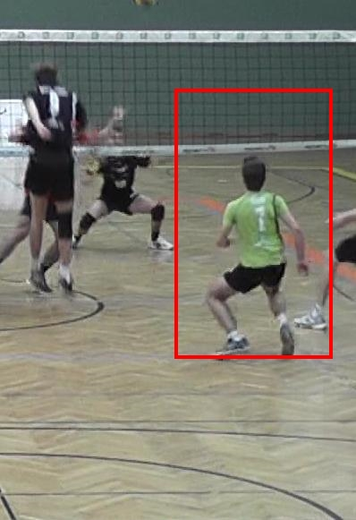

_(This page is being updated)_

 

### Activity Recognition in Sport Videos

_Course Project, Computer Vision (Fall 2016)_

We built an activity recognition system to classify actions performed by Volleyball players during a match, by leveraging views from an on-court camera and available training data for 6 classes of actions ("serve", "smash", "block" etc). We used two approaches for the problem: One using hand-crafted Optical Flow and HoG features classified using an SVM, and another approach using a CNN on raw frames.  

- <a href="https://www.dropbox.com/s/p6kdkfh5abn2kyy/Activity_Detection_in_Sports_Video.pdf" target="_blank">Project Report</a>

 

### TMMS in Colour Images

_Research Project, LRDE, EPITA (Summer 2015)_

I worked on improving the TMMS morphological operator (used for text segmentation) by devising a partial-ordering for colours based on the background of the text, to utilise the same TMMS algorithm but in a colour domain, thereby improving the text segmentation results. The results were based on the ICDAR Robust Reading Challenge Natural Scenes Dataset.

- <a href="https://www.dropbox.com/s/v8gny5cnw71ygyd/Color_TMMS_Report.pdf" target="_blank">Project Report</a>

 

### Achieving Bandwidth Guarantees in Datacenter Networks

We worked on improving the result obtained in [Chen'14, INFOCOMM] to allocate resources to Datacenter networks in view of fairness constraints. We extended the optimal resource allocation algorithm to scenarios of multiple server failures and dynamic task additions.