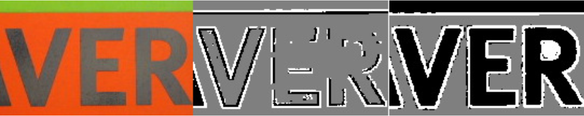

### _Work at Eyenuk and Perceptive Automata_

_My full-time work at these companies is not shown here, due to some ambiguous company policies. While I get that sorted, I am more than happy to talk to you about it over a call or in person. Please contact me to learn more!_

### Real-Time Scoreboard Detection and Recognition in Sporting Event Videos

 

_Internship Project, Gracenote (Summer 2017)_

I designed a system to extract team scores and game clock information from videos of sporting events in real-time. The system was built to be robust to occlusions, ad-breaks, and sudden changes in game scenarios. The detector worked on a variety of sporting event videos (Basketball, Hockey, Baseball etc.) on a range of sources and their custom scoreboards (ESPN, YouTube, Fox Sports etc.).

 

### Activity Recognition in Sport Videos

_Course Project, Computer Vision (Fall 2016)_

We built an activity recognition system to classify actions performed by Volleyball players during a match, by leveraging views from an on-court camera and available training data for 6 classes of actions ("serve", "smash", "block" etc). We used two approaches for the problem: One using hand-crafted Optical Flow and HoG features classified using an SVM, and another approach using a CNN on raw frames.

- <a href="https://www.dropbox.com/s/p6kdkfh5abn2kyy/Activity_Detection_in_Sports_Video.pdf" target="_blank">Project Report</a>

 

### TMMS in Colour Images

_Research Project, LRDE, EPITA (Summer 2015)_

I worked on improving the TMMS morphological operator (used for text segmentation) by devising a partial-ordering for colours based on the background of the text, to utilise the same TMMS algorithm but in a colour domain, thereby improving the text segmentation results. The results were based on the ICDAR Robust Reading Challenge Natural Scenes Dataset.

- <a href="https://www.dropbox.com/s/v8gny5cnw71ygyd/Color_TMMS_Report.pdf" target="_blank">Project Report</a>
